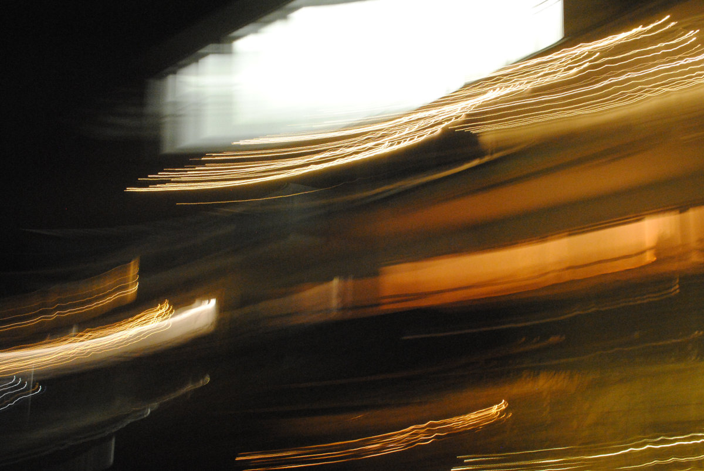
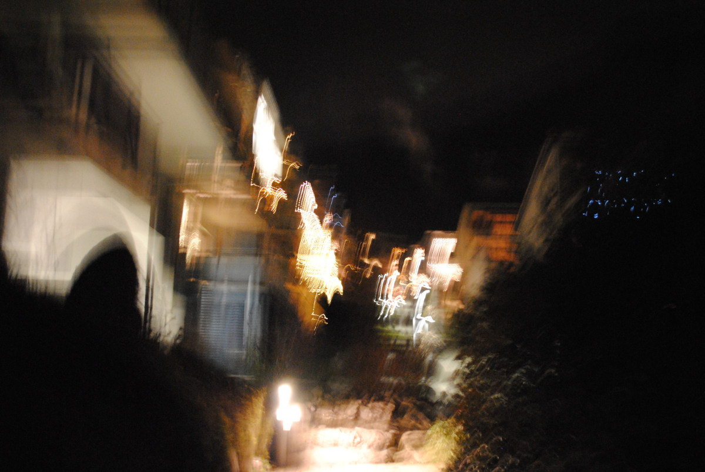
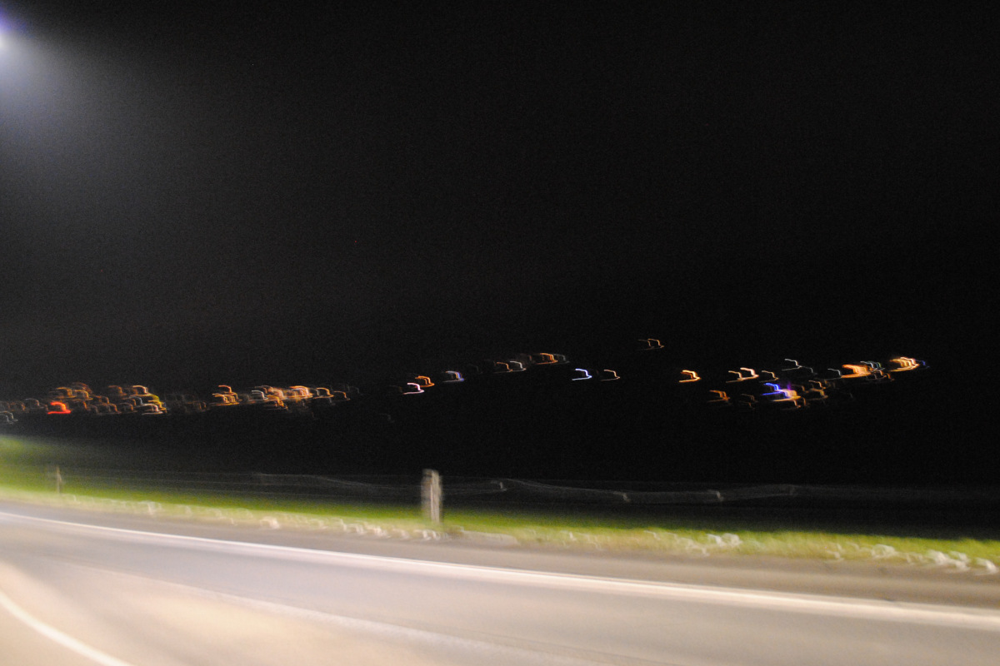

+++
title = "Das Zusammenspiel zwischen Licht und Schatten"
date = "2020-05-05"
draft = false
pinned = false
tags = ["Lernblog", "Fotoprojekt"]
image = "fotoserie3.jpg"
description = ""
footnotes = ""
+++

Die Idee von meinem Fotoprojekt war, dass ich durch das Verlaufen von Licht im Schatten ein abstraktes Bild erstelle. Um diese Idee umsetzen zu können, musste ich die Kamera so einstellen, dass ich einen möglichst hohen Lichtwert mit einem starken Kontrast erhalte. Dazu musste es draussen natürlich auch dunkel sein. Damit das ganze Bild noch etwas abstrakter wirkt, habe ich eingestellt, dass das Bild verzögert geschossen werden soll. Durch eine kleine seitliche Bewegung mit der Kamera, verlaufen die Lichter auf dem Bild.

Ich bin gegen 10 Uhr Abends durch mein Quartier gelaufen. Gegen diese Uhrzeit hatten die meisten Haushalte ihre Aussenbeleuchtung eingeschaltet. Das waren die perfekten Umstände um meine Idee umzusetzen. Die Idee, dass ich die Kamera während des Auslösens der Fotos noch bewegen kann, kam mir spontan in den Sinn.

Ein Nachteil war natürlich, dass durch die Bewegung, die Bilder an manchen Stellen etwas unscharf wurden. Es gefällt mir jedoch, dass durch die Verschwommenheit, kaum noch erkennbar ist was das Licht eigentlich ist. Auf dem Bild oben erkennt man gar nicht mehr dass es Beleuchtungen von Häuser im Hintergrund sind. Mehr sieht es nur noch nach farbigen Lichtstrichen aus. Manche dieser Bilder sehen mehr nach einem abstrakten Gemälde aus.